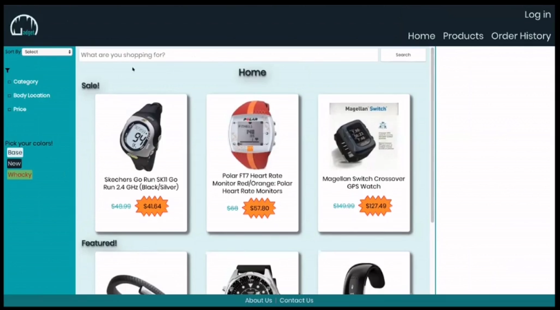
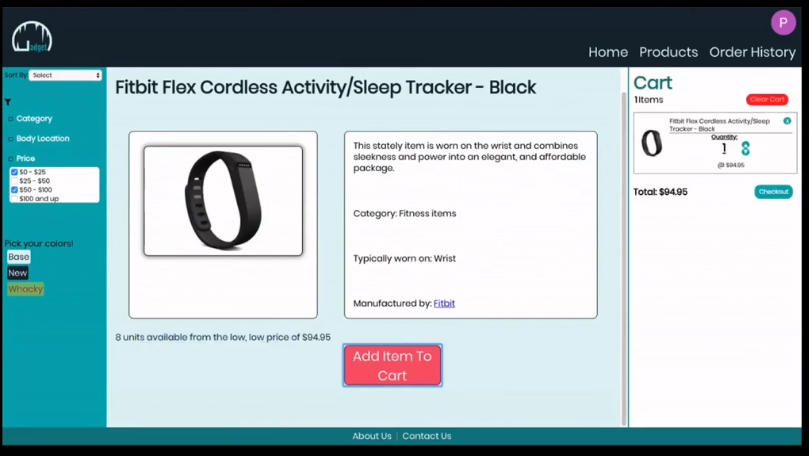
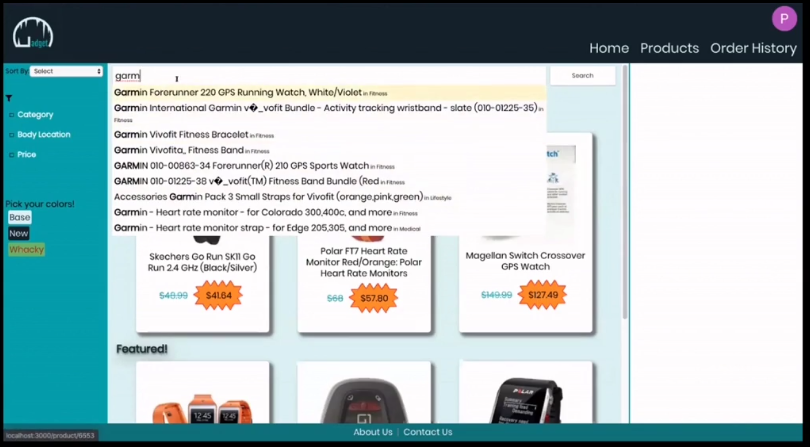
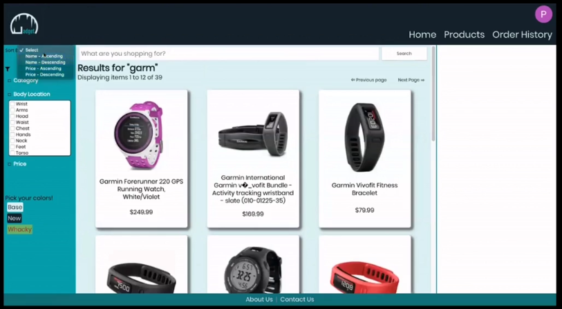
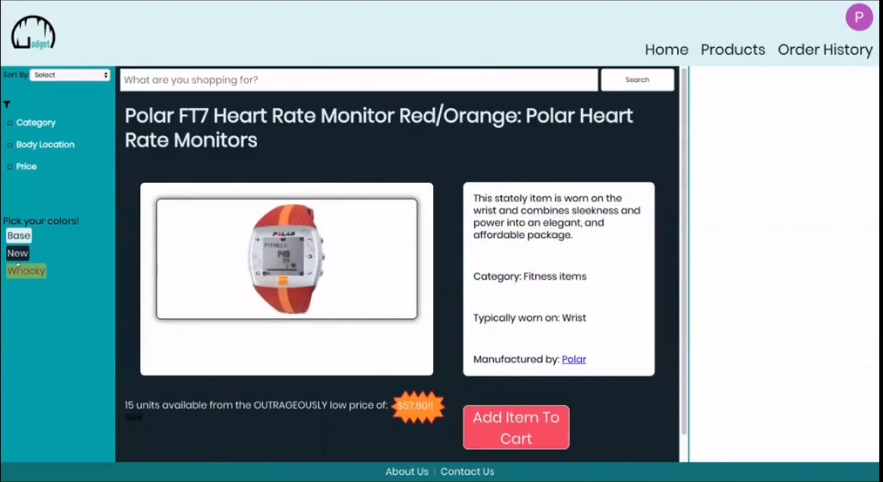
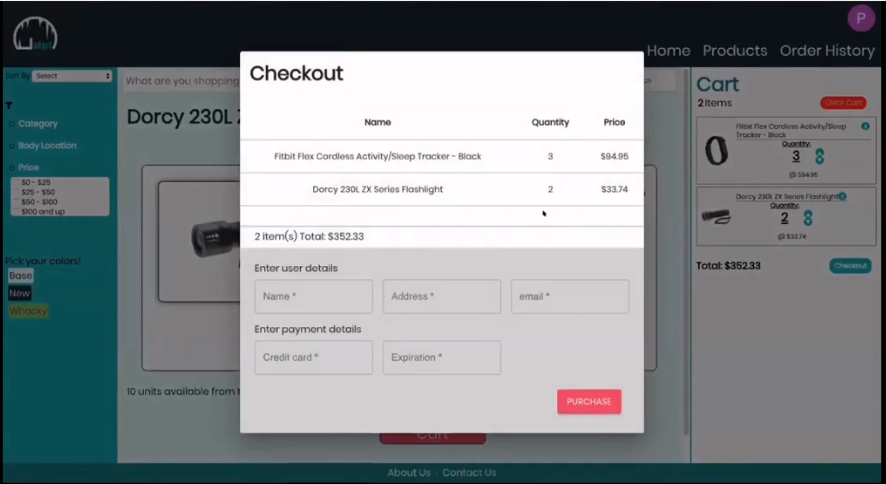
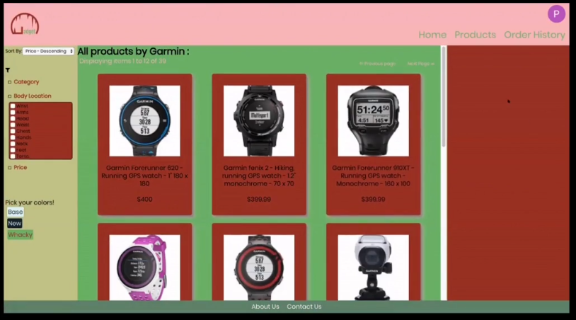
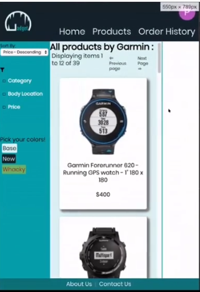

# Gadget Grotto E-Commerce Project

Developed alongside 3 colleagues, an e-commerce app in React. Serves, filters and sells health related gadgets. Log in for a full streamlined user experience and check out the dark mode setting for ease of night time shopping.

This group project was made  as part of the Full-Stack Web Development Diploma with <a href='https://concordiabootcamps.ca/' alt='link to Concordia Bootcamps website'>Concordia Bootcamps</a>.

The original app was created using static, json file, data. 

After completion MongoDB integration for data storage and access, was added by me to this instance of the project personally.

---
## Demo
- https://youtu.be/tPEHeLgkMg0

## Screen Shots
<div display='flex' flexDirection='row'>








<div>

---
## Installing
**Note** that a Mongo Database will need to be set up using the included Batch-Import.js file.
1. Clone the repo.
2. With a running mongoDB just uncomment the function call in BatchImport.js and run the file using node.
3. In both client and server directory terminals, run commands ```$yarn install``` and  ```$yarn start```.

**Alternatively:** json data and original endpoints are present, but commented out. Switch commenting with mongo endpoints to run with local data.

---
## Technologies
Technologies utilized in this project include:
### Front End:
React, Redux, JavaScript, Styled Components 
### Back End:
Express.js, Node, MongoDB

### Utilizing:
- Auth0 authentication for login.

---
## FEATURES
- Full purchasing experience from item search and multiple filtering to checkout and order retrieval.
- User login to remember your history.
- Alternative, toggleable, colour schemes for entire app.
- Sale items based on stock numbers.
- Dynamic item descriptions based off of price, location item is to be worn upon, and number in stock.
- Responsiveness for alternate viewing sizes.

---
## Key Learning: 
- Collaborating as a team on the design, structure and delegation of the project.
- Coordinating with team members to ensure that each facet of the project was understood by all members.
- Applying non-disruptive changes and additions to infrastructure built by others.


---
## Team
It was a pleasure to collaborate on this project with my teammates:
* [@Daniel Atack](https://github.com/dan-atack)💻
* [@Rony Kordahi](https://github.com/RonyKordahi)💻
* [@Paul Susset](https://github.com/PaulSusset)💻
